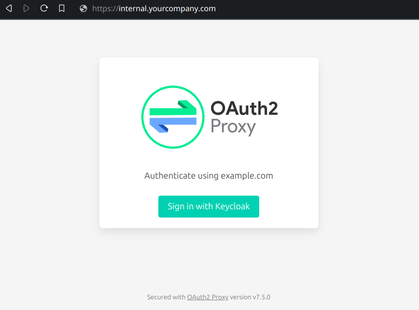

[](https://github.com/oauth2-proxy/oauth2-proxy/actions/workflows/ci.yaml)
[](https://goreportcard.com/report/github.com/oauth2-proxy/oauth2-proxy)
[](https://godoc.org/github.com/oauth2-proxy/oauth2-proxy)
[](./LICENSE)
[](https://codeclimate.com/github/oauth2-proxy/oauth2-proxy/maintainability)
[](https://codeclimate.com/github/oauth2-proxy/oauth2-proxy/test_coverage)

A reverse proxy and static file server that provides authentication using Providers (Google, Keycloak, GitHub and others)
to validate accounts by email, domain or group.

**Note:** This repository was forked from [bitly/OAuth2_Proxy](https://github.com/bitly/oauth2_proxy) on 27/11/2018.
Versions v3.0.0 and up are from this fork and will have diverged from any changes in the original fork.
A list of changes can be seen in the [CHANGELOG](CHANGELOG.md).

**Note:** This project was formerly hosted as `pusher/oauth2_proxy` but has been renamed as of 29/03/2020 to `oauth2-proxy/oauth2-proxy`.
Going forward, all images shall be available at `quay.io/oauth2-proxy/oauth2-proxy` and binaries will be named `oauth2-proxy`.



## Installation

1.  Choose how to deploy:

    a. Using a [Prebuilt Binary](https://github.com/oauth2-proxy/oauth2-proxy/releases) (current release is `v7.6.0`)

    b. Using Go to install the latest release
    ```bash
    $ go install github.com/oauth2-proxy/oauth2-proxy/v7@latest
    ```
    This will install the binary into `$GOPATH/bin`. Make sure you include `$GOPATH` in your `$PATH`. Otherwise your system won't find binaries installed via `go install`

    c. Using a [Prebuilt Docker Image](https://quay.io/oauth2-proxy/oauth2-proxy) (AMD64, PPC64LE, S390x, ARMv6, ARMv7, and ARM64 available)

    d. Using a [Pre-Release Nightly Docker Image](https://quay.io/oauth2-proxy/oauth2-proxy-nightly) (AMD64, PPC64LE, S390x, ARMv6, ARMv7, and ARM64 available)

    e. Using the official [Kubernetes manifest](https://github.com/oauth2-proxy/manifests) (Helm)

    Prebuilt binaries can be validated by extracting the file and verifying it against the `sha256sum.txt` checksum file provided for each release starting with version `v3.0.0`.

    ```
    sha256sum -c sha256sum.txt 2>&1 | grep OK
    oauth2-proxy-x.y.z.linux-amd64: OK
    ```

2.  [Select a Provider and Register an OAuth Application with a Provider](https://oauth2-proxy.github.io/oauth2-proxy/configuration/providers/)
3.  [Configure OAuth2 Proxy using config file, command line options, or environment variables](https://oauth2-proxy.github.io/oauth2-proxy/configuration/overview)
4.  [Configure SSL or Deploy behind a SSL endpoint](https://oauth2-proxy.github.io/oauth2-proxy/configuration/tls) (example provided for Nginx)


## Security

If you are running a version older than v6.0.0 we **strongly recommend you please update** to a current version.
See [open redirect vulnerability](https://github.com/oauth2-proxy/oauth2-proxy/security/advisories/GHSA-5m6c-jp6f-2vcv) for details.

## Docs

Read the docs on our [Docs site](https://oauth2-proxy.github.io/oauth2-proxy/).


## Images

From `v7.6.0` and up the base image has been changed from Alpine to [GoogleContainerTools/distroless](https://github.com/GoogleContainerTools/distroless).
This image comes with even fewer installed dependencies and thus should improve security. The image therefore is also slightly smaller than Alpine.
For debugging purposes (and those who really need it (i.e. `armv6`)) we still provide images based on Alpine. The tags of these images are suffixed with `-alpine`.

Since 2023-11-18 we provide nightly images. These images are build and pushed nightly to `quay.io/oauth2-proxy/oauth2-proxy-nightly` from `master`.
These images should be considered alpha and therefore *should not* be used for production purposes unless you know what you're doing.

## Getting Involved

If you would like to reach out to the maintainers, come talk to us in the `#oauth2-proxy` channel in the [Gophers slack](http://gophers.slack.com/).

## Contributing

Please see our [Contributing](CONTRIBUTING.md) guidelines. For releasing see our [release creation guide](RELEASE.md).
