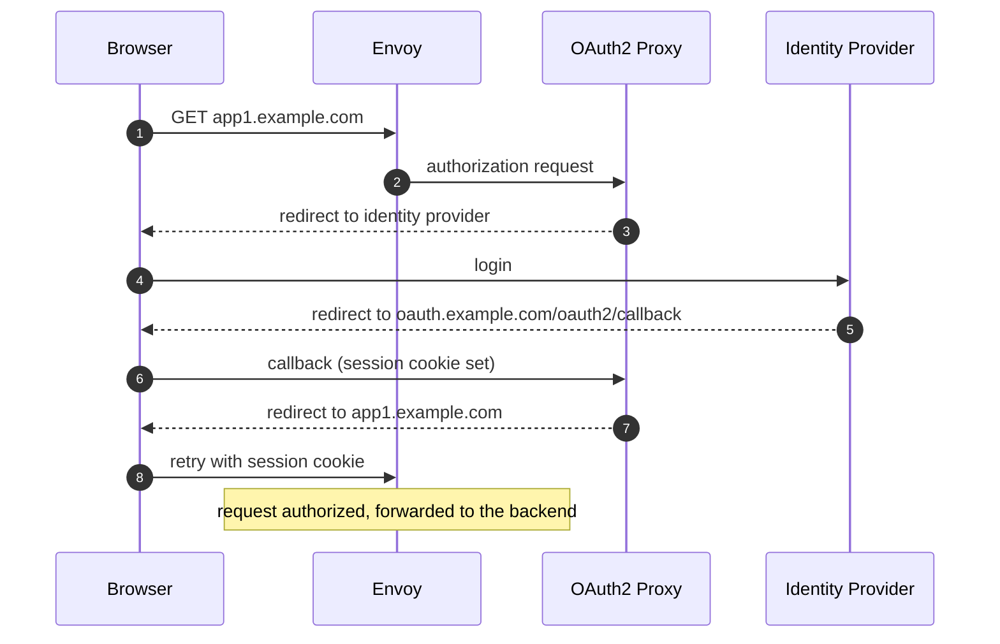

Integrate OAuth2 Proxy with [Cilium](https://www.cilium.io/) using the Gateway API `ExternalAuth` filter (requires Cilium 1.20+).

**Key features:**

- Gateway API `ExternalAuth` filter integration
- One OAuth2 Proxy deployment for multiple protected hosts or routes

## How it works

Cilium's Envoy acts as the reverse proxy in front of OAuth2 Proxy: for every request to a protected `HTTPRoute`, Envoy sends the original request to OAuth2 Proxy for authorization (including the original `Host` header and request path).



## Gateway API resources

The Gateway terminates TLS for all hostnames:

```yaml
apiVersion: gateway.networking.k8s.io/v1
kind: Gateway
metadata:
  name: public
  namespace: ingress
spec:
  gatewayClassName: cilium
  listeners:
    - name: https
      hostname: "*.example.com"
      protocol: HTTPS
      port: 443
      tls:
        certificateRefs:
          - name: example-com-tls
```

The OAuth2 Proxy `HTTPRoute` makes the callback URL reachable by the browser:

```yaml
# When using the Helm chart, use gatewayApi.enabled to create this HTTPRoute
apiVersion: gateway.networking.k8s.io/v1
kind: HTTPRoute
metadata:
  name: oauth2-proxy
  namespace: ingress
spec:
  parentRefs:
    - name: public
  hostnames: [oauth.example.com]
  rules:
    - backendRefs:
        - name: oauth2-proxy
          port: 4180
```

Each protected `HTTPRoute` adds the `ExternalAuth` filter, pointing at the same OAuth2 Proxy deployment:

```yaml
apiVersion: gateway.networking.k8s.io/v1
kind: HTTPRoute
metadata:
  name: app1
  namespace: ingress
spec:
  parentRefs:
    - name: public
  hostnames: [app1.example.com]
  rules:
    - backendRefs:
        - name: app1
          port: 8080
      filters:
        - type: ExternalAuth
          externalAuth:
            protocol: HTTP
            backendRef:
              name: oauth2-proxy
              port: 4180
            http:
              allowedHeaders:
                - Cookie
                - X-Forwarded-Proto
                - X-Forwarded-For
                # Do not allow anything else, in particular never:
                # X-Forwarded-Host, X-Forwarded-Uri, X-Real-IP,
                # X-ProxyUser-IP, CF-Connecting-IP or X-Envoy-External-Address
              allowedResponseHeaders:
                - Set-Cookie
```

## OAuth2 Proxy configuration

The following configuration values must be set for use with Cilium.

```toml
# Envoy is the reverse proxy in front of OAuth2 Proxy: trust its
# X-Forwarded-* headers from the Cilium node IPs.
reverse_proxy = true
trusted_proxy_ips = ["10.0.10.0/24"]
real_client_ip_header = "X-Forwarded-For"

# Allow redirects to *.example.com after authentication.
whitelist_domains = [".example.com"]

# The session cookie has to be valid for all protected hostnames.
cookie_domains = [".example.com"]

# ...
```

## Notes

- `trusted_proxy_ips` must contain the addresses Envoy connects from. Cilium's Envoy runs with host networking, so these are the node IPs.
- `allowedHeaders`: `Cookie` forwards the browser's cookies so the authorization check can see the session. `X-Forwarded-Proto` is set by Envoy to the detected client connection scheme and is used to select the protocol for redirect URLs.
- `allowedHeaders` should not contain anything else (OAuth2 Proxy does not consult arbitrary request headers for authentication decision). The following headers should **never** be included in the `allowedHeaders` because Cilium passes them through from the user's request and OAuth2 Proxy then treats them as trusted:
  - `X-Forwarded-Host` and `X-Forwarded-Uri`: would override the redirect target
  - `X-Real-IP`, `X-ProxyUser-IP`, `CF-Connecting-IP`, `X-Envoy-External-Address`: could spoof the client IP
- `allowedResponseHeaders`: `Set-Cookie` lets cookies set during the login flow reach the browser.
- If you want OAuth2 Proxy to access real client IPs, the `real_client_ip_header` option must be set to `X-Forwarded-For` and the header must be set in `allowedHeaders`.
- All protected hostnames must be covered by `cookie_domains`, otherwise the session cookie is not presented on authorization checks for other hostnames.
