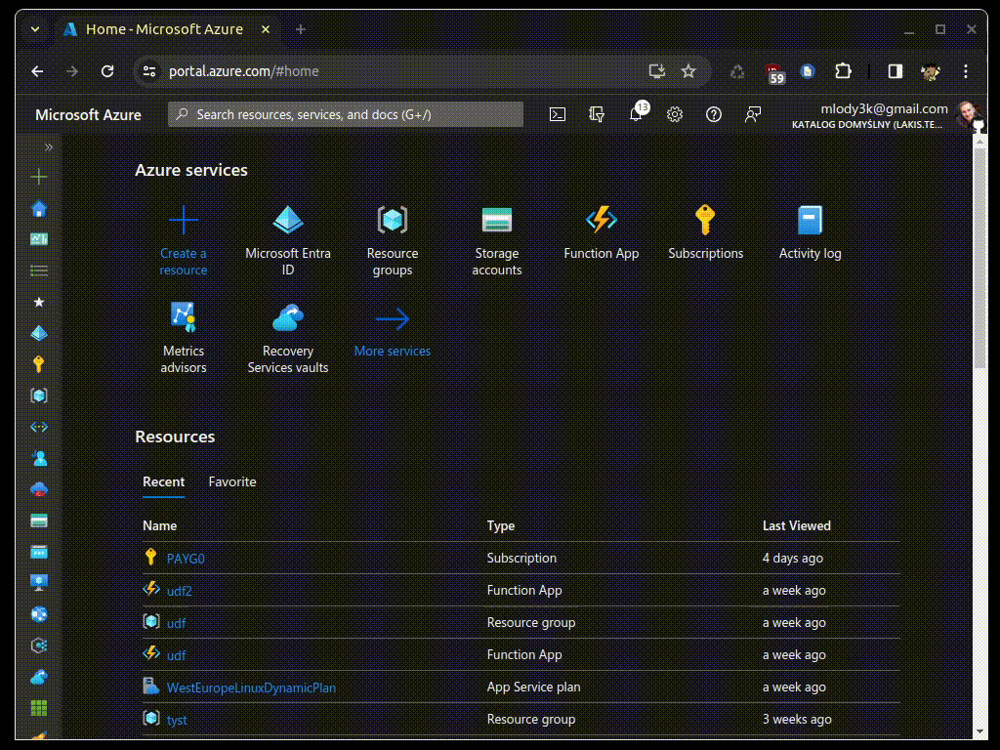
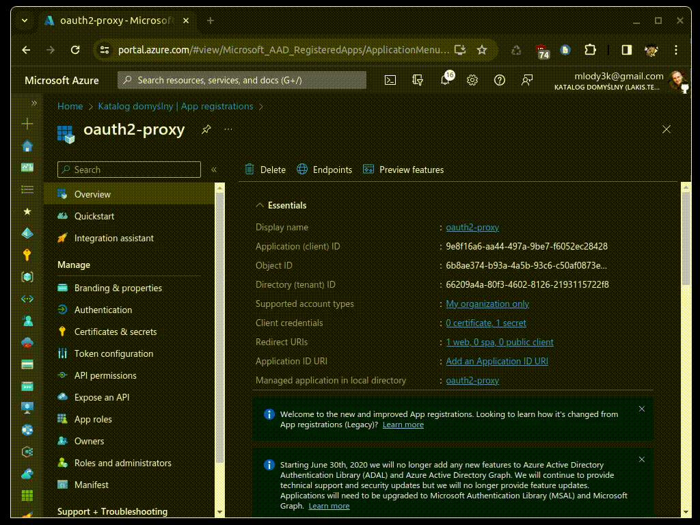

OIDC-compliant provider for Azure Entra ID application registrations. This providers support Azure oAuth V2 endpoint only, if you want to use V1 endpoint, try legacy `azure` provider.

## Configure application registration
To start, create an App registration with minimal permissions, assign redirect URI and generate secret. All account types are supported (Single tenant, multi tenant, multi tenant with MS accounts, MS accounts only).
<details>
    <summary>See Azure Portal example</summary>
    

When created with Portal, App registration automatically creates a delegated API permission for `User.Read`. 
</details>

<details>
    <summary>See Terraform example</summary>

    resource "azuread_application" "auth" {
        display_name     = "oauth2-proxy"
        sign_in_audience = "AzureADMyOrg" # Others are also supported

        web {
            redirect_uris = [
                "https://podinfo.lakis.tech/oauth2/callback",
            ]
        }

        required_resource_access {
            resource_app_id = "00000003-0000-0000-c000-000000000000" # Microsoft Graph
            resource_access {
                id   = "e1fe6dd8-ba31-4d61-89e7-88639da4683d" # User.Read delegated
                type = "Scope"
            }
        }
    }

    resource "azuread_application_password" "apppass" {
        application_id = azuread_application.auth.id
    }

</details>

This is sufficient for a simple authentication scenario.

### Configure `groups` claim
If you want to make use of groups (for example, use `--allowed-groups` feature of oauth2-proxy or authorize based on groups inside your service), you need to configure `groups` claim to be present in the ID token:
<details>
    <summary>See Azure Portal example</summary>
    
</details>
<details>
    <summary>See Terraform example</summary>

    resource "azuread_application" "auth" {
        display_name     = "oauth2-proxy"
        sign_in_audience = "AzureADMyOrg" # Other alre also supported

        group_membership_claims = [
            "SecurityGroup"
        ]
        optional_claims {
            id_token {
                name = "groups"
            }
        }

        web {
            redirect_uris = [
                "https://podinfo.lakis.tech/oauth2/callback",
            ]
        }

        required_resource_access {
            resource_app_id = "00000003-0000-0000-c000-000000000000" # Microsoft Graph
            resource_access {
                id   = "e1fe6dd8-ba31-4d61-89e7-88639da4683d" # User.Read delegated
                type = "Scope"
            }
        }
    }

    resource "azuread_application_password" "apppass" {
        application_id = azuread_application.auth.id
    }

</details>


### Configure group overage support
Azure has a limit of 200 groups in the JWT. If you can't avoid such a bug number and still want to access the groups, you need to grant `GroupMember.Read.All` delegated permission to the app registration so oauth2-proxy can read all the groups from Graph API. **NOTE**: This permission by default requires an admin consent!
<details>
    <summary>See Azure Portal example</summary>
    
</details>
<details>
    <summary>See Terraform example</summary>

    resource "azuread_application" "auth" {
        display_name     = "oauth2-proxy"
        sign_in_audience = "AzureADMyOrg" # Other alre also supported

        group_membership_claims = [
            "SecurityGroup"
        ]
        optional_claims {
            id_token {
                name = "groups"
            }
        }

        web {
            redirect_uris = [
                "https://podinfo.lakis.tech/oauth2/callback",
            ]
        }

        required_resource_access {
            resource_app_id = "00000003-0000-0000-c000-000000000000" # Microsoft Graph
            resource_access {
                id   = "e1fe6dd8-ba31-4d61-89e7-88639da4683d" # User.Read delegated
                type = "Scope"
            }
            
            resource_access {
                id   = "bc024368-1153-4739-b217-4326f2e966d0" # GroupMember.Read.All delegated - admin consent required
                type = "Scope"
            }

        }
    }

    resource "azuread_application_password" "apppass" {
        application_id = azuread_application.auth.id
    }

Admin consent is required after creation by Terraform
</details>

## Configure provider
Provider is configured via OIDC-related oauth2-proxy parameters + following provider-specific parameters:
* `azure-oidc-skip-groups-from-graph` - never read groups from Graph API, even when ID token indicates that there's a group overage. Set if you expect group overage in some cases, but still don't want to assign wide `GroupMember.Read.All`. Defaults to `false`
* `azure-oidc-multi-tenant-allowed-tenant` - speciy list of allowed tenants to be authenticated through multi-tenant app. When not set, all tenants are allowed. Defaults to `[]`.

See examples below

### Single-tenant

```
- --provider=azure-oidc
- --oidc-issuer-url=https://login.microsoftonline.com/{tenantId}/v2.0
- --client-id=<valid-client-id>
- --client-secret=<valid-client-secret>
```


### Multi-tenant app
Multi-tenant apps require to disable OIDC issuer verification, as `issuer` field in the [discovery document](https://login.microsoftonline.com/common/v2.0/.well-known/openid-configuration) is a template, not an exact value:
```
- --provider=azure-oidc
- --oidc-issuer-url=https://login.microsoftonline.com/common/v2.0
- --client-id=<valid-client-id>
- --client-secret=<valid-client-secret>
- --insecure-oidc-skip-issuer-verification
```

Configuration above insecurely allows all tenants, to allow specific tenants:
```
- --provider=azure-oidc
- --oidc-issuer-url=https://login.microsoftonline.com/common/v2.0
- --client-id=<valid-client-id>
- --client-secret=<valid-client-secret>
- --azure-oidc-multi-tenant-allowed-tenant=66209a4a-80f3-4602-8126-2193115722f8
- --azure-oidc-multi-tenant-allowed-tenant=a47d1522-8e8c-4546-a2c8-d6590ea9d6f3
- --insecure-oidc-skip-issuer-verification
```